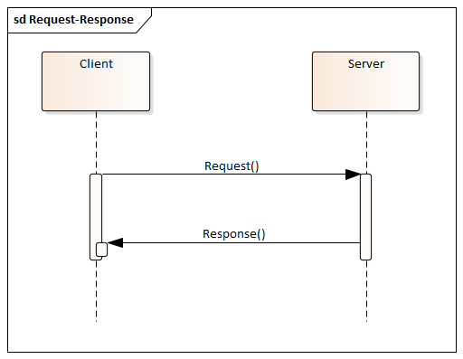
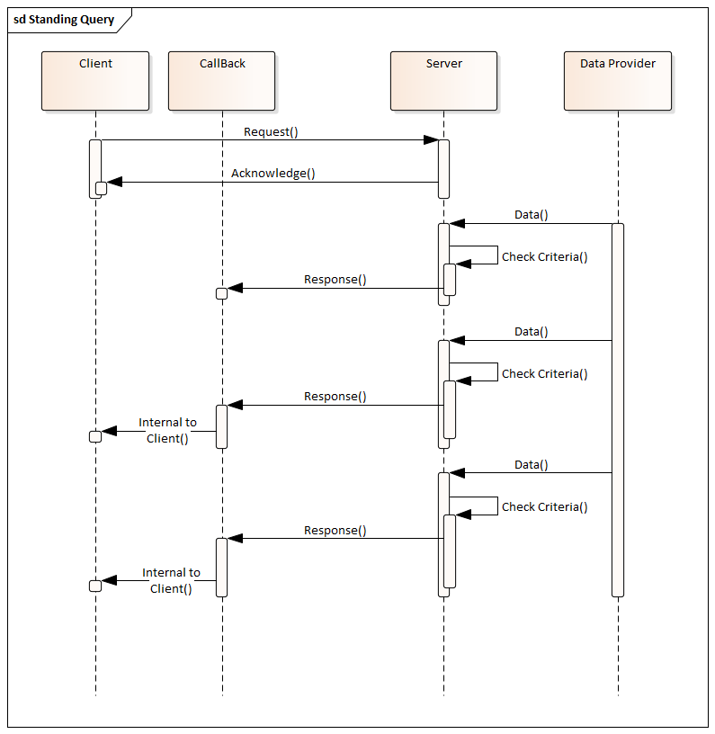
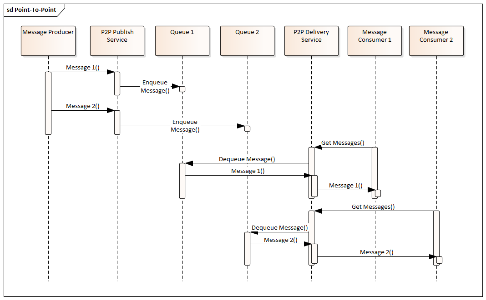
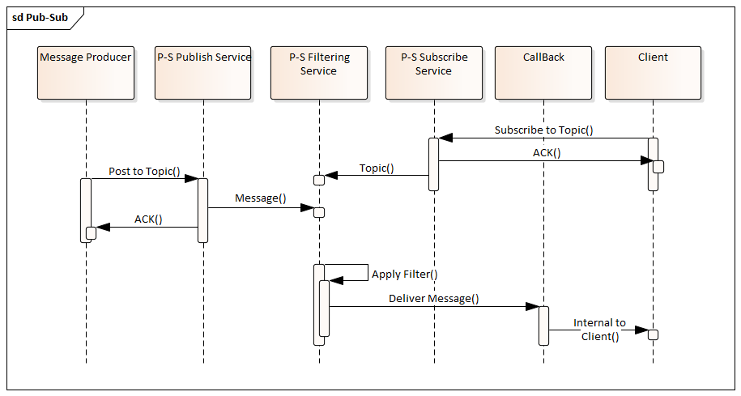

== Asynchronous Operations

An asynchronous operation is any interaction between two software entities where the concluding action does not immediately follow the initiating action. There are a number of different models for asynchronous operations. This section attempts to describe some of the more common ones. An understanding of the scope of this space will help discuss and compare the alternatives OGC faces in asynchronous services.

This section will look at three aspects of asynchronous operations:

. Asynchronous Patterns
. Message Selection
. Applications

=== Asynchronous Behavior Models

==== Request - response

Request-Response is a synchronous behavior model. A request is issued by one entity and a response is provided in return. Asynchronous behaviors can best be understood in contrast to this model.

==== Request with Callback

The OpenAPI Callback object describes "a set of requests that may be initiated by the API provider and the expected responses. The key value used to identify the callback object is an expression,  evaluated at runtime, that identifies a URL to use for the callback operation.

In other words, a callback is an http accessible resource which can receive information from the server. This differs from Request-Response in that the immediate response is not the final response. The final response to the request is delivered latter through the callback.

image::images/Callback.bmp[]

Callbacks have been implemeted as non-standard extensions to a number of OGC implementations. The change to the software is fairly minor and imposes no limitations on the functionality of the Service.

==== Standing Query

A standing query is an extension to the callback pattern where the request, once issued, stays active. The client recieves a response whenever the conditions specified in the request are met.

Standing Queries have long been used in image libraries to inform users when relevant images have arrived. Their value lies in relieving users of the need to search for new data.

Standing Queries require additional management functions to monior and terminate their execution. These functions are similar to the Stored Query management functions documented in WFS 2.0.

==== Point-to-Point

The Point-to-Point pattern uses an intermediate service to handle delivery of the message to the designated recipient. These services use a set of queues, one per recipient, to hold messages designated for the associated recipient. Recipients, in turn, can collect their messages at their leisure.

==== Publish-Subscribe

A messaging pattern where senders of messages, called publishers, do not program the messages to be sent directly to specific reveivers, called subscribers, but instead to categorize published messages into classes without knowledge of which subscribers, if any, there may be. Similarly, subscribers express interest in one or more classes and only receive messages that are of interest, without knowledge of which publishers, if any, there are. (Wikipedia)

Implemented by:

. Amazon SNS
. Azure Service Bus
. Google Cloud Pub/Sub
. IBM MQ

==== Synchronization (geosync)

=== Selection

==== Topic (Term)

==== Topic Hierarchy

MQTT uses Topic Filters to select messages. A Topic Filter is a path-like heirarch of concepts. Wildcards are supported to indicate a single path entry or multiple. For example:

. sport/tennis/player1/score/Wimbledon is a Topic Name
. sport/+/player1 is a Topic Name with a wild card for only one level
. sport/tennis/#/ranking is a Topic Name with a wild card for 1 or more levels.

Google Pub-Sub

The name of the topic from which this subscription is receiving messages. Format is projects/{project}/topics/{topic}. The value of this field will be deleted-topic if the topic has been deleted.

==== Query Expression

Java Messaging Service (JMS) is the foundation for many (most) publish-subscribe services. JMS supports messaging selection through a query string. The query language is a subset of the SQL92

==== Check Point

=== Applications

==== IoT

==== Event-Driven Architecture

