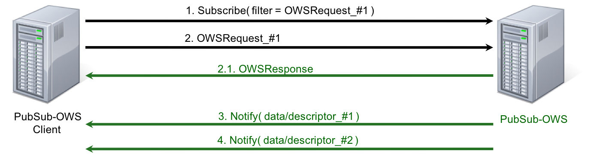
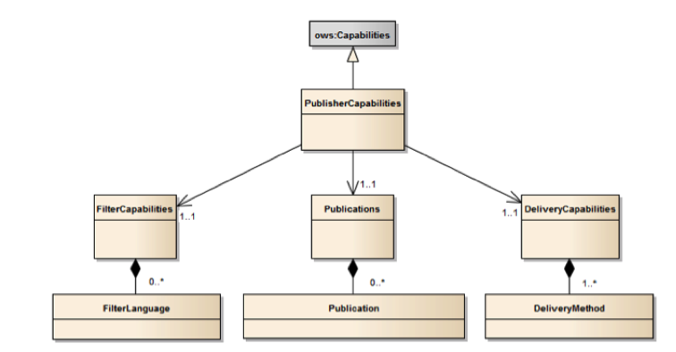
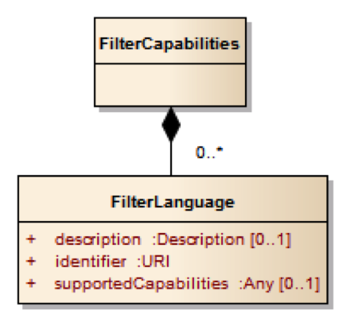
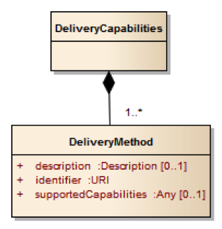
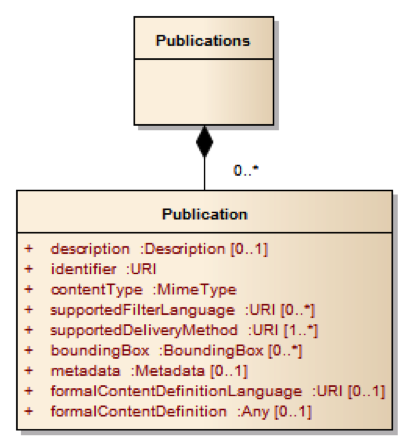
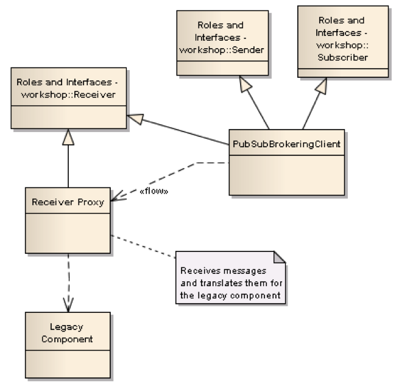
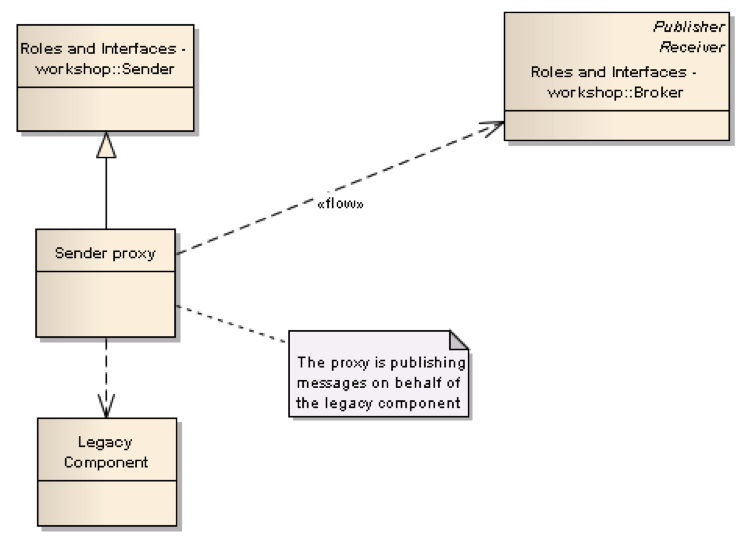

== OGC’s PubSub implementation Standard

=== Overview

The OGC has conducted significant work on event-based models and architectures in the past, resulting in the Web Notification Service (WNS) Best Practice footnote:[http://portal.opengeospatial.org/files/?artifact_id=18776], the proposed Sensor Alert and Sensor Event Service, as well as several ERs produced in previous OGC interoperability initiatives. Starting from 2010, these efforts have been subsumed under the scope of the PubSub SWG and resulted in the adoption of the Publish/Subscribe Interface Standard 1.0 in February 2016.

Although the current OGC Baseline still supports only synchronous web service request-response capabilities, there is wide consensus that standard solutions for push-based message exchange patterns are fundamental enablers of the OGC vision, for example to implement the ubiquitous sensor-based applications in the advanced proactive control scenarios envisioned by the Internet of Things.

Several work items in the OGC Testbed 12 RFQ/CFP footnote:[http://www.opengeospatial.org/standards/requests/139] have addressed the means to incorporate forms of asynchronous service interaction, including Publish/Subscribe message patterns, for example in WPS, WCS, WFS, or in geospatial queries of aviation data.

In particular, the RFQ/CFP included a specific Asynchronous Service Interaction subtask, part of a set of subtasks that aimed at enhancing the OGC Baseline, by extending OGC architectural designs through efforts that cross over several individual standards and services and are applied in a much wider scope.

The subtask description in the RFQ/CFP distinguished among three different approaches to handle asynchronous interaction with OGC Web services:

1. WPS façades;
2. Specific extensions to each OGC Web Service with asynchronous request/response capabilities;
3. OGC PubSub.

The document deliverable "A067 Implementing Asynchronous Service Response Engineering Report" (OGC 16-023) elaborates on the above approaches in situations where big chunks of data require asynchronous delivery. The ER focuses on the first and the second approach, with the goal to summarize and compare the results from using a WPS facade and an extension for WFS for asynchronous service responses, as well as to provide recommendations for future activities.

The document deliverable "A074 PubSub/Catalog Engineering Report" (OGC 16-137) focuses on the third approach, OGC PubSub, in the specific case of catalogs, investigating the functional requirements of an interoperable, push-based data discovery solution.

As underlined in the RFQ/CFP, it is important to provide methods that support notification (push) of new data as opposed to search (pull), given the volume of data that will be available in catalogs in the near future.

=== PubSub features

The recently approved OGC PubSub standard is intended as an overarching model to extend services with Publish/Subscribe capabilities. The Publish/Subscribe model is distinguished from the request/reply and client/server models by the asynchronous delivery of messages and the ability for a Subscriber to specify an ongoing (persistent) expression of interest.

The PubSub specification is agnostic as to what constitutes a change, i.e. an event that should cause a notification by a Publisher (aka its event model). It is only required that a Publisher instance communicate what notifications it will emit by advertising them in the Publication section of its Capabilities document.

Likewise, the PubSub standard is agnostic as regards delivery methods. It defines a Publisher role that may support multiple delivery methods, such as ATOM, AMQP, or SOAP, as advertised in its Capabilities document, in the DeliveryCapabilities section. By implementing the Publisher interface, a PubSub-OWS may offer more than one method of delivery for each Publication, to be chosen by Subscribers. Publish/Subscribe would imply push-style message delivery, however some methods may actually be pull-based (e.g. polling), under the hood.

Hence, both the solutions investigated in ER OGC 16-023, the WPS façade and the specific WFS extension for asynchronous responses, are compatible with the PubSub standard and may be integrated in an application.

The application of OGC PubSub to OGC Catalogue Services allows an analyst to register and be notified when new metadata records become available. Such new OGC-compliant PubSub-enabled discovery service supports and promotes the system architecture of the Testbed 12 Initiative, as a fundamental building block to advance the current OGC standard baseline. As a consequence, such work may contribute to the enhanced availability of standards-based offerings in the marketplace.

=== Basic PubSub 1.0 extension for the generic OWS

This chapter summarizes the PubSub extension for the generic OWS introduced by OGC 16-137. This extension is conceived as a simple way to enable the existing request/reply OWS specifications to Publish/Subscribe, by implementing the OGC Publish/Subscribe Interface Standard 1.0.

An OWS implementing this extension is capable of accepting its usual requests as filters, and of sending notifications about data/metadata updates, based on its existing semantics and syntax expressiveness.

=== Conceptual model
This chapter describes how PubSub 1.0 Core operations, encodings and messages are modeled in terms of the functionalities of the generic OWS. No assumption is made on the capabilities of the target OWS, other than those defined by the OGC Web Services Common Standard. Hence this extension may apply, for example, to WFS, WCS, and other OWS interfaces.

The PubSub specification is agnostic as to what constitutes a change, i.e. an event that should cause a notification by a Publisher (aka its event model). It is only required that a Publisher instance communicate what notifications it will emit by advertising them in the Publication section of its Capabilities document (see below).

In general, a PubSub-OWS may be able to notify about changes to any component of its information set. For example, it may notify about changes to its Capabilities document.
The extension introduced in this chapter addresses the most general case, at the expenses of efficiency and semantic accuracy. The precise definition of an event model for the various OWS's is left to the relevant OGC Working Groups.

The basic PubSub-OWS MEP can be generalized as follows (see figure <<OWS_MEP>>):

1. The OWS client subscribes specifying a request to be used as filter for the notifications;
2. The OWS client obtains the Time-0 response via a standard Request/Reply, with the same request as above;
3. The OWS notifies the client of subsequent updates to the response, according to its existing semantics and syntax.

[[OWS_MEP]]
[#OWS_MEP,reftext='{figure-caption} {counter:figure-num}']
.OWS Publish/Subscribe MEP

This may be formalized in an “OWS Request/Reply Publisher” Conformance Class that:

* Accepts OWS requests as subscription filters
** The Publisher may constraint the filter expressions allowed in Subscriptions (e.g. by imposing OpenSearch templates)
* Sends corresponding OWS responses to notify about data/metadata updates

This MEP is a simple way to enable existing OWSs to PubSub, allowing to bind the PubSub 1.0 Core operations, encodings and messages to the standard OWS functionalities, data models, and semantics.

=== Required Capabilities components
PubSub Core requires that the OWS advertise the implemented Conformance Classes in its Capabilities document, namely in the Profile property of the ServiceIdentification section (as of OWS Common 1.1). Besides, it requires that the additional Capabilities components represented in figure <<PubSubCapabilitiescomponents>> are returned in the GetCapabilities response, but does not specify the specific mechanism for incorporating these additional Capabilities components into the OWS Capabilities document. These extension proposes to include these additional Capabilities components in the ExtendedCapabilities of the OWS, as detailed in the following chapters.

[[PubSubCapabilitiescomponents]]
[#PubSubCapabilitiescomponents,reftext='{figure-caption} {counter:figure-num}']
.PubSub Capabilities components

==== FilterCapabilities
The FilterCapabilities section describes the filtering-related capabilities of a PubSub-OWS, i.e. the filter languages it supports for matching events against subscriptions (e.g., OGC Filter Encoding). This allows the pluggability of filter languages.

[[OWSFilterCapabilities]]
[#OWSFilterCapabilities,reftext='{figure-caption} {counter:figure-num}']
.Filter Capabilities

The SupportedCapabilities elements allows restricting the acceptable requests, possibly providing templates. The following Capabilities snippet declares that this PubSub-OWS instance (namely, a CSW) accepts as subscription filters GetRecords requests conforming to the specified OpenSearch template. Multiple templates may be introduced, specifying multiple FilterLanguages.

.FilterCapabilities
[source,xml]
----
<FilterCapabilities>
   <FilterLanguage>
      <Abstract>This PubSub-OWS accepts requests as subscription filters, according to the OpenSearch template specified in SupportedCapabilities.
      </Abstract>
      <Identifier>http://www.opengis.net/spec/pubsub/1.0/conf/ows/request-reply-publisher</Identifier>
      <SupportedCapabilities>http://tb12.essi-lab.eu/pubsub-csw/services/opensearch?ct={count?}&amp;st={searchTerms?}&amp;bbox={geo:box?}&amp;ts={time:start?}&amp;te={time:end?}
      </SupportedCapabilities>
   </FilterLanguage>
</FilterCapabilities>
----

==== DeliveryCapabilities
The DeliveryCapabilities section describes the delivery methods supported by the PubSub-OWS, e.g. SOAP, WS-Notification, ATOM, SSE, WebSockets, OAI-PMH. This allows the pluggability of delivery methods.

[[DeliveryCapabilities]]
[#DeliveryCapabilities,reftext='{figure-caption} {counter:figure-num}']
.Delivery Capabilities

The following Capabilities snippet declares that this PubSub-OWS instance delivers notifications via SSE (see chapter <<DeliveryMethods>>, below).

.DeliveryCapabilities
[source,xml]
----
<DeliveryCapabilities>
   <DeliveryMethod>
      <Abstract>This PubSub-OWS supports notification delivery via SSE.
      </Abstract>
      <Identifier>http://www.w3.org/TR/eventsource/
      </Identifier>
   </DeliveryMethod>
</DeliveryCapabilities>
----

[[DeliveryMethods]]
===== Delivery methods
The DeliveryCapabilities section describes the methods supported by the PubSub-OWS for delivering notifications.
Publishers may offer more than one method of delivery for each Publication, to be chosen by Subscribers. Publish/Subscribe would imply push-style message delivery, however some methods may actually be pull-based (e.g. polling), under the hood.

Examples include: SOAP and related technologies, such as  WS-Notification (used by PSSB), ATOM (polling using the “If-Modified-Since” and “start-index” parameters), PubSubHubbub, OAI-PMH (polling using the “from” parameter), e-mail, SMS, WebSockets, SSE.

Server-Sent Events (SSE) is a pure push-style communication technology based on HTTP and the SSE EventSource API standardized as part of HTML5 by the W3C. A SSE client (e.g. all modern HTML 5.0 browsers) receives automatic updates from a server via HTTP connection, simply setting the following parameters:

* ContentType: "text/event-stream;charset=UTF-8”
* Cache-Control: "no-cache”
* Connection: "keep-alive”

==== Publications
The Publications section describes the contents offered by the PubSub-OWS, i.e. the sequences of notifications that Subscribers can subscribe to.

[[Publications]]
[#Publications,reftext='{figure-caption} {counter:figure-num}']
.Publications

The following Capabilities snippet declares a publication that notifies on all the relevant events for this PubSub-OWS. Notifications can be filtered with the semantics of the requests of this OWS and are delivered via SSE, encoded in JSON (see chapter <<OWSNotificationEncoding>>, below).

.Publications
[source,xml]
----
<Publications>
   <Publication>
      <Abstract>>This publication notifies on all the relevant events for this PubSub-OWS.
      </Abstract>
      <Identifier>ALL</Identifier>
      <ContentType>application/json</ContentType>
      <SupportedFilterLanguage>http://www.opengis.net/spec/pubsub/1.0/conf/ows/request-reply-publisher</SupportedFilterLanguage>
      <SupportedDeliveryMethod>http://www.w3.org/TR/eventsource/</SupportedDeliveryMethod>
   </Publication>
</Publications>
----

[[OWSNotificationEncoding]]
===== Notification encoding
For the generic OWS instance, no operation is defined that provides the basic semantics of “insert”, “update”, and “delete” actions on the content managed by the instance.

The most generic mechanism to notify about updates is that the Publisher re-send the whole response element corresponding to the request used as filter in the Subscription. For example, in the case of WFS, if the client subscribes with a wfs:GetFeature request as a filter, the PubSub-WFS should notify about any changes by delivering a standard wfs:FeatureCollection, in response to that request.

By receiving the new response and comparing it with the previous one, a Subscriber can figure out the changes. Future evolutions of this extension may evaluate more efficient and semantically accurate encoding of notifications. A possible option for XML-based content types is XMLdiff (e.g. XML Patch, RFC 5261), or annotations (XML attributes) to add simple CRUD semantics on top of the existing XSDs.

[[LegacyComponents]]
=== Support to legacy components
The integration of legacy components in an eventing architecture is desirable in a number of scenarios. However, legacy components may not be instrumented to monitor their state for the purpose of notification, nor to react upon notifications from other components (or they may, but by legacy, non-standard mechanisms).

Implementing the PubSub 1.0 Standard in a legacy component may not be feasible or practical. In some cases, the legacy component can be adapted to the Publish/Subscribe MEP by an additional functional entity that realize the Publish/Subscribe functionalities. Such mediating entity acts as a proxy/adapter, i.e. a middleman between the source and the target of the message exchange, implementing the behavior and/or the interfaces required by the PubSub specification.

This use case has been considered in the phase of requirement analysis for the PubSub 1.0 standard footnote:[See also the Proxied Publish/Subscribe use case (access restricted to OGC Members): https://portal.opengeospatial.org/wiki/PUBSUBswg/PubSubSwgUseCaseBrokeredPubSub] and is supported by the Brokering Publisher Conformance Class of the PubSub 1.0 Standard.

Depending on the intended role of the legacy component, the use case is twofold:

* Proxied Subscribe – a proxy/adapter component subscribes to a Publisher on behalf of the legacy system and acts appropriately upon receiving notifications of interest.

[[ProxiedSubscribe]]
[#ProxiedSubscribe,reftext='{figure-caption} {counter:figure-num}']
.Proxied subscribe

* Proxied Publish – a proxy/adapter component monitors the legacy system and generates appropriate notifications upon relevant events (according to a given event model). The proxy/adapter may act as a full-fledged Publisher, accepting Subscriptions against the sequence of notifications, or just act as a pure Sender, relaying each notification to another Publisher entity (see figure <<ProxiedPublish>>).

[[ProxiedPublish]]
[#ProxiedPublish,reftext='{figure-caption} {counter:figure-num}']
.Proxied publish

The Brokering Publisher Conformance Class of the PubSub 1.0 Standard supports this use case. In fact, a Brokering Publisher (or, more simply, a broker), is an intermediary between Subscribers and other Publishers which have been previously registered with the broker. The broker is not the original producer of messages, but only acts as a message middleman, re-publishing messages received from other Publishers and decoupling them from their Subscribers. A broker may shuffle or aggregate messages into different publications, may offer publications with different delivery methods than the original ones, or otherwise process the messages (e.g. converting their format). A broker may also provide advanced messaging features, such as load balancing.

In general, a broker is a distinct third party that acts as a communication intermediary between the source and the target of a communication, mediating their interfaces and in some cases adding new behavior. Hence, a broker may conveniently act as a proxy/adapter for one or more legacy components, flexibly implementing any combination of the above twofold use case.

The Brokering Publisher Conformance Class does not mandate any specific behavior to be implemented, in particular as regards the support to Delivery Capabilities, Filtering Capabilities, and Publications of the brokered Publishers. Brokers are free to interact with the brokered Publishers as appropriate for their specific application. Interactions may include subscribing to the offered publications, harvesting the data, decorating the capabilities, or other behavior (future extensions of the Conformance Class may standardize the behavior of Brokering Publishers in specific application scenarios).

Examples of Brokering Publisher applications include the following:

* Publisher Aggregation – a broker subscribes to several Publishers and relays their publications (without modifications) to interested Subscribers, acting like a Proxy to multiple Publishers. Optionally, the broker may adapt the service interface (binding) of the aggregated Publishers.
* Publication Aggregation – a broker receives messages generated by several Publishers (e.g. dumb sensors) and publishes them to the interested Subscribers as a single publication at a single endpoint, for the sake of simpler connectivity, or improved accountability, or easier management of subscriptions, etc.
* GeoSynchronization (GSS) - GSS is a mediation service that controls transactional access to one or more WFS's (e.g. to moderate updates in crowdsourcing scenarios).
A GSS maintains several event channels, including one for changes applied to the WFS content. Clients can subscribe to the channels (possibly specifying a filter) and be notified by the GSS whenever new entries appear.
A GSS may be used to monitor insert/update/delete operations performed on one or more WFS's and send appropriate notifications, implementing the PubSub 1.0 Brokering Publisher Conformance Class. Whenever an event (i.e. a Transaction) occurs on a WFS, the GSS will notify Subscribers of that event. In this way WFS's that do not implement the PubSub 1.0 Standard can participate in an eventing architecture. There are plans to extend GSS to other OGC access services, such as WCS.
