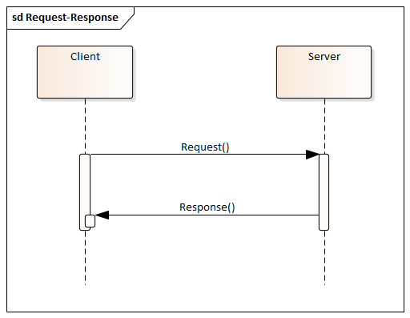
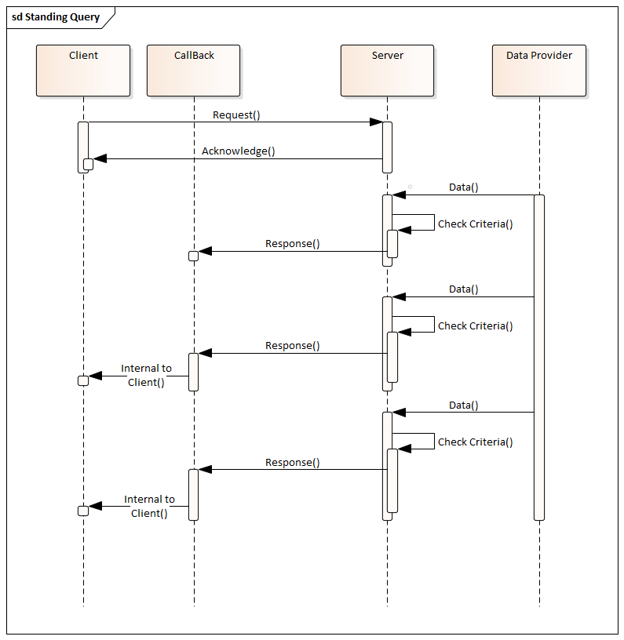
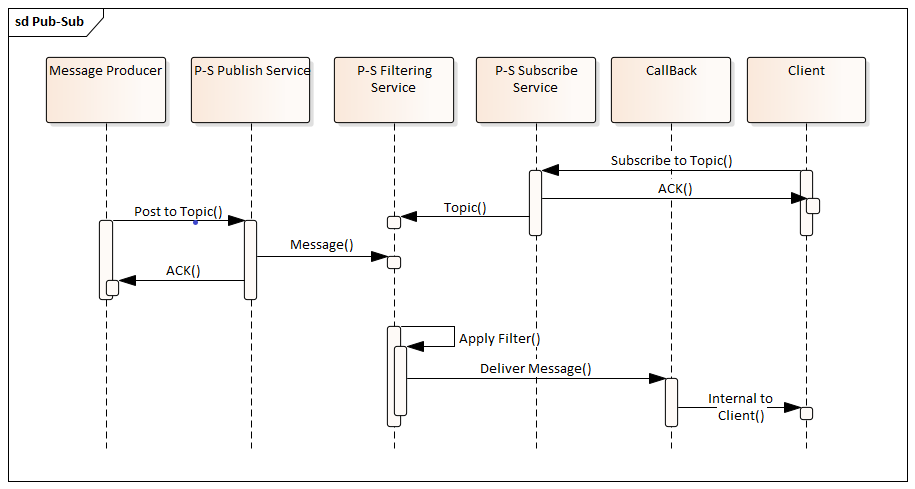

== Asynchronous Operations

An asynchronous operation is any interaction between two software entities where the concluding action does not immediately follow the initiating action. There are several different models for Asynchronous Operations. This section attempts to describe some of the more common ones. An understanding of the scope of this space will help discuss and compare the alternatives OGC faces in asynchronous services.

This section will look at three aspects of asynchronous operations:

. The overall pattern of behavior
. How the two entities rendezvous
. The criteria for selecting response messages

=== Behavior Models

==== Request-Response

Request-Response is a synchronous behavior model. A request is issued by one entity and a response is provided in return (<<#img_Req_Res>>). Asynchronous behaviors can best be understood in contrast to this model.

[#img_Req_Res,reftext='{figure-caption} {counter:figure-num}']

.Request-Response behavior model

==== Delayed Response

This model differs from Reqest-Response in that the immediate response is not the final response. Rather it acknowedges successful receipt of the request. The final response is to be delivered latter (<<#img_Delayed-Response>>).

A key part of this pattern is the callback. A callback is an http accessible resource which can receive information (responses) from the server for the client.

[#img_Delayed-Response,reftext='{figure-caption} {counter:figure-num}']
.Delayed Response behavior model
image::images/Callback.png[width=800,align="center"]

==== Standing Request

A Standing Request is a variation of the Delayed Response pattern. While a Delayed Response performs a single operation, a Standing Request is active until instructed to stop (<<#Standing_Request>>).

[#Standing_Request,reftext='{figure-caption} {counter:figure-num}']
.Standing Request behavior model

==== Synchronization

The Synchronization pattern supports a scenario where communication between the message producer and consumer is intermittent. When communication is possible, they perform whatever transactions are needed to synchronize their states, then establish a checkpoint for that state. Both parties can then continue to operate independently until the next synchronization opportunity arrives.

==== Publish-Subscribe

A messaging pattern where senders of messages, called publishers, do not program the messages to be sent directly to specific receivers, called subscribers, but instead to categorize published messages into classes without knowledge of which subscribers, if any, there may be. Similarly, subscribers express interest in one or classes and only receive messages that are of interest, without knowledge of which publishers, if any, there are. (Wikipedia)

The Publish-Subscribe model is distinguished from the request/reply and client/server models by the asynchronous delivery of messages and the ability for a Subscriber to specify an ongoing (persistent) expression of interest.

Alternate Text

The Publish-Subscribe model completely separates message producers and consumers. Potential consumers of messages create filtering criteria which describe the types of messages they wish to receive. They then "subscribe" to a Publish-Subscribe service with this filtering criteria. Producers of messages "publish" those messages to the Publish-Subscribe service along with a set of tags which describe each message. The Publish-Subscribe service evaluates the tags against the filtering criteria of all subscribers. The message is forwarded to all subscribers who's criteria are met.

The "publish" operation follows the Request-Response pattern. The "subscribe" operation follows the Standing Request pattern.

==== Broadcast

Broadcast is the simplest asynchronous pattern. The message producer simply sends the message to everyone. It is left up to the recipients to decide what to do with it.

=== Notification and Alert

An inherent property of Asynchronus operations is that there is no persistent connection between the message producer and message receiver. Therefore, there must be a way for the message producer to re-establish a connection with the receiver in order to complete the transaction. There are a number of ways this is done.

==== Callback

Callbacks can be viewed as mini-services who's sole purpose is to receive an asychronous response. Information on how to access the callback is provided with the initial request. Message producers (or their agents) use this information deliver responses, typically using the Request-Response pattern.

==== Polling

In polling the requesting entity checks on the status of their request on a recurring basis. Upon completion of the request, the requestor retrieves the result to complete the transaction.

==== Stored response queue

A stored response queue is a service which holds responses to asynchoronous requests. The message producer simply leaves the response in the queue, and it's up to the requestor to retrieve it.

==== Man in the Loop

If all else fails, let the human do it. Many alternatives are available including instand messaging, e-mail, phone calls, even the Postal Service.

=== Filtering

Filtering allows a message producer to identify the intended recipients of a message.

==== Event (RSS, SNMP)

Event filtering specifies that a notification will be sent if certain conditions occure. For example, if the free space in a mail box drops below 10%.

[[topic-hierarchy-section]]
==== Topic Hierarchy

Publish-Subscribe implementations typically define a set of topics (terms) which can be used to select messages for delivery. In the most basic case a recipient can only subscribe to topics. More capable systems may provide a simple query language to go with the topic vocabulary.

Example: MQTT uses Topic Filters to select messages. A Topic Filter is a path-like hierarchy of concepts. Wildcards are supported to indicate a single path entry or multiple. For example:

. sport/tennis/player1/score/Wimbledon is a Topic Name
. sport/+/player1 is a Topic Name with a wild card for only one level
. sport/tennis/#/ranking is a Topic Name with a wild card for 1 or more levels.

==== Query expression (Standing Query)

Java Messaging Service (JMS) is the foundation for many (most) publish-subscribe services. JMS supports messaging selection through a query string. The query language is a subset of the SQL92

More capable systems support a full query language for filtering messages. For example, an asynchronous WFS would accept asynchronous requests using the same Filter Encoding language as any other WFS. But the results would be returned asynchronously.

==== Check Point

A check point is a store snapshot of the state of the system as a specific date and time. All changes made after a check point are can
