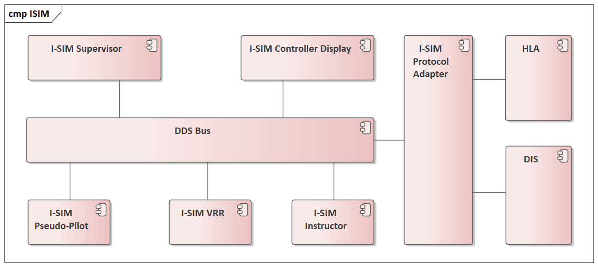

== Air Traffic Control Simulators

Kongsberg I-SIM® was originally developed for the https://en.wikipedia.org/wiki/Federal_Aviation_Administration[Federal Aviation Administration (FAA)] as the Air Traffic Control Advanced Research Simulator (ATCARS). I-SIM is a high-fidelity simulation system used for Air Traffic Control Training, Air Space design/analysis, advanced Computer-Human Interface (CHI) and Human-Machine Interface (HMI) development, and to support Unmanned Aviation System (UAS) integration into civil airspace. I-SIM is also used to model high-density airspaces for commercial airspace design.

I-SIM uses InterCOM DDS (https://en.wikipedia.org/wiki/Data_Distribution_Service[Data Distribution Service]) as the middleware solution for sharing data between its components. InterCOM DDS is an implementation of the https://en.wikipedia.org/wiki/Object_Management_Group[Object Management Group] (OMG) Data Distribution Service whose purpose is to abstract away the mechanics of transport and persistence while distributing data among distributed nodes. +

DDS is a networking middleware that simplifies complex network programming. It implements a publish–subscribe pattern for sending and receiving data, events, and commands among the nodes. Nodes that produce information (publishers) create "topics" (_e.g._, telemetry, location) and publish "samples". DDS delivers the samples to subscribers that declare an interest in the topic. +

DDS handles transfer chores: message addressing, data marshalling and de-marshalling (so subscribers can be on different platforms from the publisher), delivery, flow control, retries, _etc._ Any node can be a publisher, subscriber, or both simultaneously. The DDS publish-subscribe model virtually eliminates complex network programming for distributed applications. +

DDS supports mechanisms that go beyond the basic publish-subscribe model. The key benefit is that applications that use DDS for their communications are decoupled. Little design time needs to be spent on handling their mutual interactions. In particular, the applications never need information about the other participating applications, including their existence or locations. DDS transparently handles message delivery without requiring intervention from user applications, including:

* determining who should receive the messages
* determining where recipients are located
* what happens if messages cannot be delivered

DDS allows the user to specify Quality of Service (QoS) parameters to configure discovery and behaviour mechanisms up-front.
By exchanging messages anonymously, DDS simplifies distributed applications and encourages modular well-structured programs.
DDS also automatically handles hot-swapping redundant publishers if the primary fails. Subscribers always get the sample with the highest priority whose data is still valid (that is, whose publisher-specified validity period has not expired).
DDS automatically switches back to the primary when it recovers, too.

At the core of the product is a Supervisor which generates track data and beacon messages. The I-SIM Track XML message is sent from the I-SIM Supervisor for each current flight once per second and contains flight plan information as well as detailed aircraft state data.
Detailed state data is primarily used in the I-SIM Pseudo-Pilot and Instructor applications.
Beacon messages are simulated radar contacts and are used to simulate ground radars.
The I-SIM Beacon message is sent from the I-SIM Supervisor for each current flight once per radar sweep (or once per second for Automatic Dependent Surveillance–Broadcast (ADS–B) targets) representing the radar and/or ADS-B target and includes position and transponder data. Transponder data generally includes Mode 3/A and Mode C (altimeter corrected) codes. I-SIM radar processing supports ADS-B, Primary Surveillance Radar (PSR) and Secondary Surveillance Radar (SSR) returns.
The information is published on the DDS bus and participants that subscribe to these topics will receive it and decode it.

The controller displays a replica of the En-Route displays used by FAA and both Standard Terminal Automation Replacement System (https://web.archive.org/web/20071130081034/http://hf.tc.faa.gov/projects/stars.htm[STARS]) terminal control and En-Route Automation Modernization (https://www.faa.gov/air_traffic/technology/eram/[ERAM]) are supported.
STARS replaces outdated equipment in Terminal Radar Approach CONtrol (TRACON) and tower facilities.  It provides controllers with critical operational information about aircraft positions, flight data, and weather.
STARS also provides many new capabilities that allow technical operations personnel to monitor and control system resources.  +

Messages published by the Supervisor are processed and information is displayed on the screen.
The operator can modify the information and resend the message using DDS.
The pseudo-pilot receives via DDS requests from the operator using the controller display and will notify the supervisor to change the behaviour of the simulated aircraft.

[#cmp_ISIM,reftext='{figure-caption} {counter:figure-num}']
.I-SIM® components diagram

I-SIM® (<<#cmp_ISIM>>) includes a Voice Recognition/Response (VRR) module, providing an automated alternative for live pseudo-pilot operators when used in Air Traffic Management (ATM) / Air Traffic Control (ATC) training.  I-SIM VRR accepts verbal commands from the air traffic controller and executes them as the aircraft should, providing voice responses to the operator as it does so. The VRR module requires very little voice recognition “training” when being used by a new operator, and provides nearly 98% comprehension of voice commands with most operators out of the box. +

I-SIM VRR is a tool for training environments where there is limited space or personnel, and is currently in use as part of the Air Traffic Control Training System on all U.S. Navy aircraft carriers and amphibious assault ships. +

Across the voice recognition software and Voice over Internet Protocol (VoIP) industry, the DDS architecture is not
considered mature and fast enough to be utilized as a transport layer in such a simulator.
In that context, DDS would introduce “voice jitter” and related delays, which would render
the audio information contained in the DDS messages unusable thus impacting VRR’s
usefulness as a training system.

For the voice recognition and audio components to work properly, the messages must arrive in the right order/sequence to be understood by trainees. Any delays or incorrect sequencing of messages can cause “voice jitter” or inaudible voice commands which would severely impact training (audio portions of the training exercise would be useless). +

Kongsberg Geospatial extended InterCOM (Intercommunication) DDS to implement a new communication messaging process to remove any ‘voice jitter’ experienced by the U.S. Navy.
I-SIM includes a protocol adapter allowing DDS messages to be translated to and from other simulation standards such as
https://standards.ieee.org/standard/1278_2-2015.html[Distributed Interactive Simulation (DIS) IEEE (Institute of Electrical and Electronics Engineer) Standard 1278] and https://standards.ieee.org/standard/1516-2010.html[High-Level Architecture (HLA) IEEE Standard 1516]. By using this approach, customers can include their own simulators and provide more efficient training.
