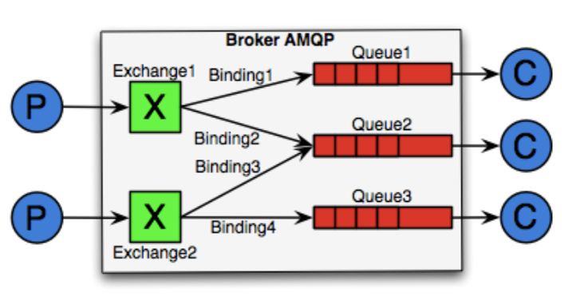
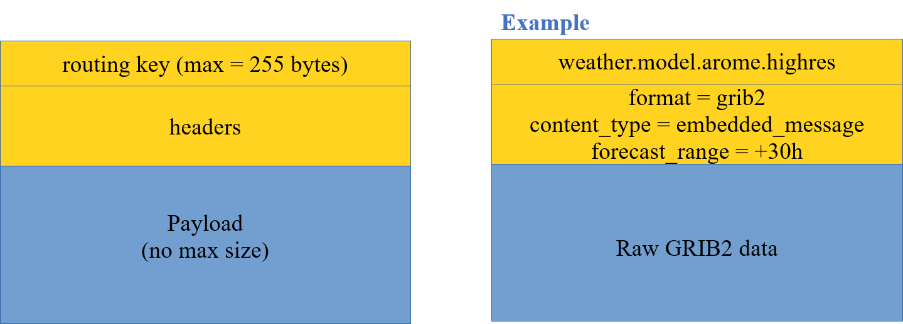
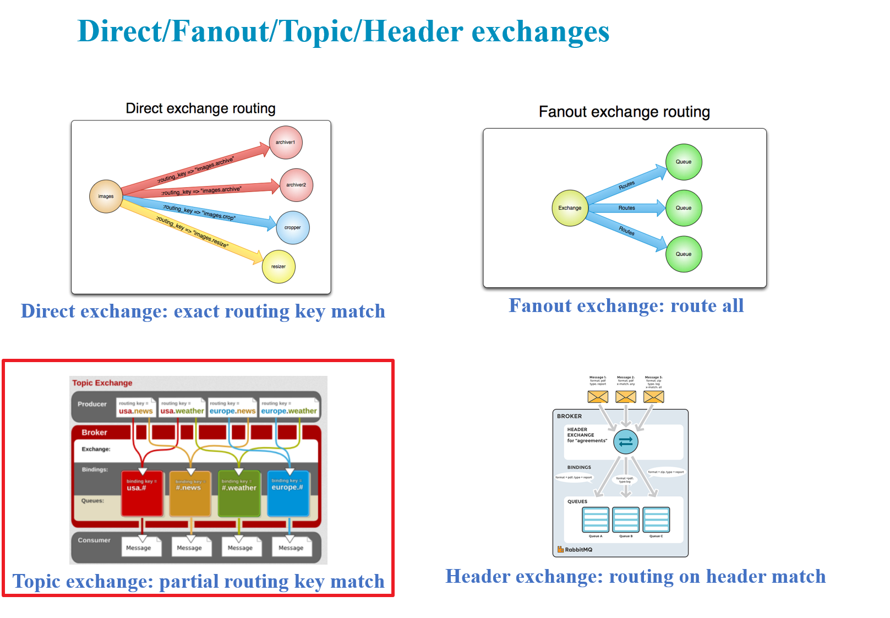

== WMO OpenWIS use of AMQP

The OpenWIS Association, lead by Meteo France, is examining the use of pubsub services to disseminate Meteorological data as part of the World Meteorological Organization (WMO) Information System (WIS) 2 draft technical specification.  The OpenWIS Association conducted an initial WIS 2 study on message protocols and found that several use cases were well positioned to use pubsub.  This included but was not limted to the current use of WAN for WMO GTS data dissemination, and  use of the WAN for NHMs specific users (aeronautical, B2B and general public).

The WIS 2 study also examined a number of message queue protocols the OpenWIS Program could use including: AMQP, MQTT, STOMP, JMS, Kafka, Redis.  However, only 2 were found to use ISO standards (AMQP and MQTT).  For a long time, the FAA SWIM aprogram has been very
successful in standardizing on the mature JMS API for pub/sub. However, an interoperability limitation in the wire-level protocol for JMS being vendor dependent forced the SWIM program to seek other open source alternatives.  SESAR/Eurocontrol is now very much interested in AMQP v1.0 publish/subscribe message protocol as a promising new ISO, IEC, and OASIS international standard, that
offers SWIM an open publish-subscribe messaging protocol.  Given that, the WIS 2 study focused on specific queues that support AMQP.  

The first MQ to be analyzed was RabbitMQ.  RabbitMQ supports several message queue protocols including:  AMQP 0-9-1, AMQP 1.0 (via a plugin), STOMP, MQTT, HTTP (API).  In addition, the study found that RabbitMQ has implemented extensions to AMQP.
  
In support of our WIS 2 study, the following figure (see figure <<clause7_figure1>>) shows the proposed AMQP Architecture

[[clause7_figure1]]
[#clause7_figure1,reftext='{figure-caption} {counter:figure-num}']
.OWS Publish/Subscribe FIG1

  
In our proposed AMQP architecture, all connections are TCP based. There is no UDP.  Publish is performed to an exchange, not to a queue.  There can be N exchanges.  Subscriptions lead to the creation of: 1) a queue (if needed); 2) bindings from exchange to queue.  Two basic principles will apply:  If there is no binding, there is no routing, and in turn the message is discarded.  Also, once messages are consumed, they disappear.

Figure <<clause7_figure2>> describes one of the proposed AMQP message structure for OpenWIS WIS2
  
[[clause7_figure2]]
[#clause7_figure2,reftext='{figure-caption} {counter:figure-num}']
.OWS Publish/Subscribe FIG2

  
Four types of exchanges are being considered for OpenWIS, including Direct, Fanout, Topic, and Header exchanges.  Figure <<clause7_figure3>> describes each of these exchanges
  
[[clause7_figure3]]
[#clause7_figure3,reftext='{figure-caption} {counter:figure-num}']
.OWS Publish/Subscribe FIG3

RabbitMQ tunable settings used during WIS2 study:
 - Make queues lazy
   - Store messages on disk (predictable response times)
 - Make queues persistent
   - Allows to route messages even if consumer not connected
 - Tune prefetch
   - Allows to use all bandwidth even with on high latency WAN
 - Need to be mindful of big files
 - Be careful when sending send files bigger than a few Kbs
RAM Impact (files loaded to RAM)
Transfer times

The proposed message format used during the WIS2 study can be found in figure <<clause7_figure4>>

[[clause7_figure4]]
[#clause7_figure4,reftext='{figure-caption} {counter:figure-num}']
.OWS Publish/Subscribe FIG4

A single Node pubsub implementation can be found in figure <<clause7_figure5>>. 

The results of the study found:
1.  When you compare Reference vs Direct message dissemination methods, large message always need to be disseminated by reference
2.  For small messages there are questions, including where or not to incude messages into payload.  It appears to be difficult to set a threshold.  This leads to a more complicated protocol, and also leads to less predictable message rate.  And finally, it leads to potential issues with memory management
3.  The conclusion was to not include message into payload.

The next steps in the study include:
1.  Agree pubsub tree.  It must be TTAAiiCCCC based.  It must be data types based, productor based, or a mix.
2.  Need to stabilize the message format
3.  Conduct a larger scale test

The key for this is to think about how this could be implemented in the frame of WIS/GTS
 * Need Pub/Sub for “GISCs”
 * Need Pub/Sub for “Ncs”
 * Need SLA / Key Performance Indicators
 * Need Metadata

